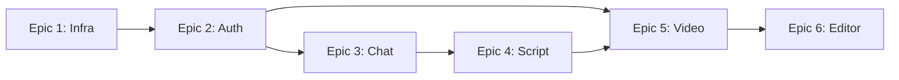

# Quick Start: 3-Developer Team Allocation

**TL;DR:** 12 weeks, track-based ownership, mock-first parallelization.

---

## 🎯 Developer Assignments

```
Dev 1: INFRASTRUCTURE & FOUNDATION
  → Epic 1 (Weeks 1-2) + Epic 2 (Weeks 3-5)
  → DevOps, AWS, Auth, Brands

Dev 2: AI & CONVERSATION
  → Epic 3 (Weeks 3-5) + Epic 4 (Weeks 6-7)
  → OpenAI, Chat, Script Generation

Dev 3: VIDEO & EDITOR
  → Epic 5 (Weeks 3-7) + Epic 6 (Weeks 10-11)
  → FFmpeg, Sora, Editor Integration
```

---

## 📅 12-Week Schedule

### **Weeks 1-2: ALL TOGETHER → Epic 1 (Infrastructure)**

```
┌──────────────────────────────────────────────────────┐
│ Dev 1: AWS (Terraform, RDS, Redis, S3, ECS)          │
│ Dev 2: Backend CI/CD (Docker, GitHub Actions)        │
│ Dev 3: Frontend CI/CD (Electron builds)              │
└──────────────────────────────────────────────────────┘
✅ Deliverable: Infrastructure deployed to staging
```

---

### **Weeks 3-5: PARALLEL → Epic 2, Epic 3, Epic 5**

```
┌─────────────────────┬──────────────────────┬─────────────────────┐
│ Dev 1: Epic 2       │ Dev 2: Epic 3        │ Dev 3: Epic 5       │
│ Auth & Brands       │ AI Chat              │ Video Pipeline      │
│ ✓ REAL              │ ⚠️ MOCKED Auth       │ ⚠️ MOCKED All       │
├─────────────────────┼──────────────────────┼─────────────────────┤
│ • Google OAuth      │ • OpenAI GPT-4       │ • RQ workers        │
│ • JWT tokens        │ • Chat UI            │ • Replicate Sora    │
│ • Brands CRUD       │ • 5 questions flow   │ • Replicate TTS     │
│ • S3 uploads        │ • Req extraction     │ • Suno music        │
│ • UI pages          │ • State mgmt         │ • FFmpeg pipeline   │
└─────────────────────┴──────────────────────┴─────────────────────┘
✅ Deliverable: Each epic deployed to staging (with mocks for Dev 2/3)
```

---

### **Weeks 6-7: PARALLEL → Epic 4, Epic 5 (continued)**

```
┌─────────────────────┬──────────────────────┬─────────────────────┐
│ Dev 1: Support      │ Dev 2: Epic 4        │ Dev 3: Epic 5       │
│ Help others         │ Script Generation    │ (continued)         │
│                     │ ⚠️ MOCKED Auth       │ ⚠️ MOCKED All       │
├─────────────────────┼──────────────────────┼─────────────────────┤
│ • DB optimization   │ • Script gen API     │ • Audio mixing      │
│ • Deployment        │ • OpenAI prompts     │ • Progress tracking │
│ • Code reviews      │ • Review UI          │ • Testing pipeline  │
│ • Help Dev 2/3      │ • Regeneration       │ • S3 uploads        │
└─────────────────────┴──────────────────────┴─────────────────────┘
✅ Deliverable: Epic 4 and Epic 5 functional with mocks
```

---

### **Week 8: INTEGRATION → ALL TOGETHER**

```
┌──────────────────────────────────────────────────────┐
│ ALL DEVELOPERS: Replace mocks with real APIs        │
├──────────────────────────────────────────────────────┤
│ Dev 1 → Dev 2: Epic 3/4 now use real auth/brands    │
│ Dev 1 → Dev 3: Epic 5 now uses real auth/brands     │
│ Dev 2 → Dev 3: Epic 5 now uses real scripts         │
│                                                       │
│ • Fix integration bugs                               │
│ • End-to-end testing                                 │
│ • Merge all epics to main                            │
└──────────────────────────────────────────────────────┘
✅ Deliverable: Complete flow works: Signup → Brand → Chat → Script → Video
```

---

### **Week 9: E2E TESTING → ALL TOGETHER**

```
┌──────────────────────────────────────────────────────┐
│ ALL DEVELOPERS: Testing & polish                    │
├──────────────────────────────────────────────────────┤
│ • E2E tests                                          │
│ • Performance testing                                │
│ • Load testing                                       │
│ • Bug fixes                                          │
│ • Security review                                    │
└──────────────────────────────────────────────────────┘
✅ Deliverable: Production-ready system
```

---

### **Weeks 10-11: Epic 6 → Editor Integration**

```
┌─────────────────────┬──────────────────────┬─────────────────────┐
│ Dev 1: Support      │ Dev 2: Polish        │ Dev 3: Epic 6       │
│ 30%                 │ 30%                  │ 100% (Lead)         │
├─────────────────────┼──────────────────────┼─────────────────────┤
│ • Download APIs     │ • UI/UX polish       │ • Download to local │
│ • S3 optimization   │ • Error handling     │ • Zapcut integration│
│ • Performance       │ • Loading states     │ • Asset library     │
└─────────────────────┴──────────────────────┴─────────────────────┘
✅ Deliverable: Editor integration complete
```

---

### **Week 12: PRODUCTION LAUNCH → ALL TOGETHER**

```
┌──────────────────────────────────────────────────────┐
│ ALL DEVELOPERS: Deploy to production                │
├──────────────────────────────────────────────────────┤
│ • Final production checks                            │
│ • Production deployment                              │
│ • Smoke tests                                        │
│ • Monitoring verification                            │
│ • Launch!                                            │
└──────────────────────────────────────────────────────┘
✅ Deliverable: Live production system 🚀
```

---

## 🔑 Key Concepts

### 1. Mocking Enables Parallelization

Developers work in parallel by using **fake data** for dependencies:

**Dev 2's mock (Weeks 3-5):**
```typescript
// Fake user/brand while Dev 1 builds real auth
const mockUser = { id: 'user-123', email: 'test@example.com' }
const mockBrand = { id: 'brand-123', title: 'Test Shoes' }
```

**Dev 3's mock (Weeks 3-7):**
```python
# Fake everything while others build
mock_user = User(id='user-123')
mock_brand = Brand(id='brand-123', product_images=['test.jpg'])
mock_script = Script(scenes=[...])
```

**Week 8:** Replace all mocks with real APIs from Dev 1 & Dev 2.

---

### 2. Epic Dependencies



**Solution:** Use mocks to break dependencies during development.

---

### 3. File Ownership (Prevents Conflicts)

```
Backend:
api/routes/
├── auth.py         ← Dev 1 only
├── brands.py       ← Dev 1 only
├── chat.py         ← Dev 2 only
├── scripts.py      ← Dev 2 only
├── generation.py   ← Dev 3 only

Frontend:
stores/
├── authStore.ts           ← Dev 1 only
├── brandStore.ts          ← Dev 1 only
├── adProjectStore.ts      ← Dev 2 only
├── generationStore.ts     ← Dev 3 only
```

**Result:** Minimal merge conflicts.

---

## 📊 Workload Distribution

| Developer | Weeks 1-2 | Weeks 3-5 | Weeks 6-7 | Week 8 | Week 9 | Weeks 10-11 | Week 12 |
|-----------|-----------|-----------|-----------|--------|--------|-------------|---------|
| Dev 1     | 100% E1   | 100% E2   | 40% Support | 100% Int | 100% Test | 30% Support | 100% Launch |
| Dev 2     | 100% E1   | 100% E3   | 100% E4   | 100% Int | 100% Test | 30% Polish  | 100% Launch |
| Dev 3     | 100% E1   | 100% E5   | 100% E5   | 100% Int | 100% Test | 100% E6     | 100% Launch |

**Total:** ~120 hours/developer/epic, ~480 hours total

---

## ✅ Daily Checklist

### Daily Standup (15 min)

**3 Questions:**
1. What did I complete yesterday?
2. What am I working on today?
3. Am I blocked? Which files am I modifying?

**Example (Week 4):**
- **Dev 1:** "Completed OAuth, working on brand CRUD. Files: `api/routes/brands.py`"
- **Dev 2:** "Built chat UI, integrating OpenAI today. Files: `api/routes/chat.py`, `pages/ChatPage.tsx`"
- **Dev 3:** "Tested RQ workers, adding Sora API today. Files: `tasks/video_generation.py`"

---

### Daily Workflow

**Morning:**
```bash
# Pull latest
git checkout epic-X-name
git pull origin epic-X-name

# Check for conflicts with main (after Week 5)
git log main..HEAD
```

**During Day:**
```bash
# Commit frequently
git add .
git commit -m "feat(epic-X): description"
git push origin epic-X-name
```

**End of Day:**
- Push all commits
- Update team on Slack
- Note any blockers for standup

---

## 🚨 Common Pitfalls & Solutions

### Pitfall 1: "Epic 1 is taking too long!"
**Solution:** Don't rush. Epic 1 is the foundation. Better to spend 3 weeks getting it right than 2 weeks and redo later.

### Pitfall 2: "Dev 2/3 can't work without Epic 2!"
**Solution:** Use mocks! Hardcode user/brand data. Replace in Week 8.

### Pitfall 3: "Merge conflicts during integration!"
**Solution:**
- Separate files per epic (see file ownership above)
- Daily standups announce file changes
- Rebase frequently on main

### Pitfall 4: "OpenAI/Replicate APIs are unreliable!"
**Solution:**
- Mock API responses during development
- Test with real APIs in Week 8-9
- Have retry logic and error handling

### Pitfall 5: "We're behind schedule!"
**Solution:**
- Identify bottleneck epic
- Reallocate resources (e.g., Dev 1 helps Dev 3 with Epic 5)
- Cut scope if necessary (defer Epic 6 to post-launch)

---

## 📋 Sprint Goals

| Sprint | Weeks | Goal | Demo |
|--------|-------|------|------|
| Sprint 1 | 1-2 | Infrastructure ready | Deploy sample API to staging |
| Sprint 2 | 3-5 | Auth + Chat working | Signup → Create brand → Chat with AI |
| Sprint 3 | 6-7 | Script + Video pipeline | Generate script → Generate video |
| Sprint 4 | 8 | Integration complete | Full flow: Signup → Video |
| Sprint 5 | 9 | Production ready | Pass all E2E tests |
| Sprint 6 | 10-11 | Editor integration | Video → Edit → Export |
| Sprint 7 | 12 | Launch | Production deployment |

---

## 🎯 Success Metrics

### Week 2 Checkpoint
- ✅ Can deploy backend to staging in < 10 minutes
- ✅ Database migrations run automatically
- ✅ Frontend builds for macOS/Windows

### Week 5 Checkpoint
- ✅ Users can signup and create brands (Epic 2)
- ✅ Chat interface responds with AI (Epic 3, mocked auth)
- ✅ Video pipeline generates sample videos (Epic 5, mocked data)

### Week 8 Checkpoint
- ✅ All mocks removed
- ✅ Complete flow works: Signup → Brand → Chat → Script → Video
- ✅ No blocking bugs

### Week 12 Checkpoint
- ✅ Production deployment successful
- ✅ Users can create videos end-to-end
- ✅ Monitoring shows green health
- ✅ Launch! 🎉

---

## 🚀 Getting Started

### Day 1: Setup

**All developers:**
1. Clone repository
2. Review epic documentation (`docs/epics/README.md`)
3. Review this allocation guide
4. Set up development environment
5. Create epic branches:
   ```bash
   git checkout -b epic-1-infrastructure
   ```

### Day 2-10: Epic 1 (Weeks 1-2)

**Dev 1:** Start AWS infrastructure (Terraform)
**Dev 2:** Start backend CI/CD (Dockerfile, GitHub Actions)
**Dev 3:** Start frontend CI/CD (Electron builder)

**Daily:** Standup, commit progress, demo on Friday

### Week 3: Epic 2/3/5 Kickoff

**Dev 1:** Branch `epic-2-auth-brands`, start auth
**Dev 2:** Branch `epic-3-chat`, start with mocks
**Dev 3:** Branch `epic-5-video`, start with mocks

**Key:** Define API contracts upfront so mocks match real APIs.

---

## 📚 Documentation Index

1. **README.md** - Epic overview and user journeys
2. **ALLOCATION-OPTIONS.md** - Detailed comparison of allocation strategies
3. **TEAM-ALLOCATION.md** - Original 3-dev strategy with mocking details
4. **QUICK-START.md** - This file (at-a-glance guide)
5. **Epic-1-Infrastructure-Deployment.md** - Epic 1 full spec
6. **Epic-2-Authentication-Brand-Management.md** - Epic 2 full spec
7. **Epic-3-AI-Chat-Requirements-Gathering.md** - Epic 3 full spec
8. **Epic-4-Script-Generation-Review.md** - Epic 4 full spec
9. **Epic-5-Video-Generation-Pipeline.md** - Epic 5 full spec
10. **Epic-6-Editor-Integration-Export.md** - Epic 6 full spec

---

## 🤝 Team Agreement

Before starting, all developers should agree on:

1. ✅ **Daily standups** at [TIME]
2. ✅ **Weekly demos** every Friday
3. ✅ **Code review** within 24 hours of PR
4. ✅ **No merge to main** without approval
5. ✅ **Mocking strategy** for parallel development
6. ✅ **File ownership** to prevent conflicts
7. ✅ **Communication channel** (Slack #zapcut-dev)
8. ✅ **Working hours** and async communication norms

---

## 📞 Need Help?

**Blocked on dependencies?**
→ Use mocks, define interface contracts

**Merge conflicts?**
→ Check file ownership, rebase on main

**Behind schedule?**
→ Weekly sync to reallocate resources

**Technical questions?**
→ Slack #zapcut-dev or tag relevant developer

**Epic unclear?**
→ Read full epic spec in `docs/epics/Epic-X-*.md`

---

**Ready to start? Begin with Epic 1! 🚀**

---

**Document Status:** Quick Reference ✅
**Recommended Reading Order:**
1. This file (QUICK-START.md)
2. Epic-1-Infrastructure-Deployment.md
3. Your assigned epic (Epic-2, Epic-3, or Epic-5)
4. ALLOCATION-OPTIONS.md (for detailed strategy)
