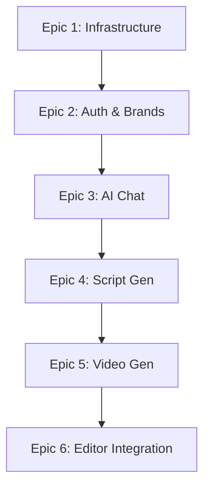

# Zapcut AI - Epic Overview

This directory contains the complete epic breakdown for the AI Video Generation Pipeline project. Each epic represents a **vertical slice** - a fully functional, end-to-end feature with complete frontend UI, backend API, and database implementation.

---

## Epic Sequencing

```
Epic 1 (1-2 weeks) → Epic 2 (2-3 weeks) → Epic 3 (2-3 weeks) → Epic 4 (2 weeks) → Epic 5 (4-5 weeks) → Epic 6 (2 weeks)
    Foundation           Auth & Brands        AI Chat           Script Gen      Video Pipeline      Editor Integration
```

**Total Estimated Duration:** 14-18 weeks (~3.5-4.5 months)

---

## Epic 1: Infrastructure & Deployment Pipeline

**Priority:** P0 (Must complete FIRST)
**Duration:** 1-2 weeks

### Purpose
Establish production-ready infrastructure and CI/CD so every subsequent epic can be deployed and tested immediately.

### Key Deliverables
- AWS infrastructure provisioned (RDS, S3, ECS, Redis)
- CI/CD pipeline for backend (GitHub Actions → ECR → ECS)
- CI/CD pipeline for frontend (Electron builds)
- Database migrations automated
- Monitoring and logging operational
- Smoke tests run after deployment

### Success Criteria
✅ Backend API deploys automatically on push to main
✅ Database migrations run automatically
✅ Electron app builds for macOS/Windows/Linux
✅ Monitoring dashboards show application health

### Why First?
Every subsequent epic needs deployment infrastructure. Starting here ensures:
- No "big bang" deployment at the end
- Every epic is production-tested as it's built
- Team gets familiar with deployment early
- Infrastructure issues discovered early

---

## Epic 2: Authentication & Brand Management

**Priority:** P0 (MVP)
**Duration:** 2-3 weeks
**Dependencies:** Epic 1

### Purpose
Users can securely create accounts and manage brand profiles with product images.

### Key Deliverables
- **Frontend:** Landing page, login/signup pages, brands dashboard, create/edit brand modals
- **Backend:** Auth endpoints (email + Google OAuth), brand CRUD APIs, image upload to S3
- **Database:** `users` and `brands` tables

### User Journey
1. New user signs up (email/password or Google)
2. Lands on empty brands dashboard
3. Creates brand with product images
4. Sees brand in list
5. Can edit/delete brands

### Success Criteria
✅ Users can register and log in
✅ Sessions persist across app restarts
✅ Users can create brands with 2+ product images
✅ Users can edit and delete brands
✅ Authorization enforced (users see only their brands)

### Demo
```
Sign Up → Create Brand (upload images) → View Brands List → Edit Brand → Delete Brand
```

---

## Epic 3: AI Chat & Requirements Gathering

**Priority:** P0 (MVP)
**Duration:** 2-3 weeks
**Dependencies:** Epic 1, 2

### Purpose
Users describe video requirements through natural AI conversation.

### Key Deliverables
- **Frontend:** Chat interface with message bubbles, typing indicator, progress tracking
- **Backend:** OpenAI GPT-4 integration, conversation management, structured data extraction
- **Database:** `ad_projects` and `chat_messages` tables

### User Journey
1. User clicks brand card → Chat opens
2. AI greets user and asks about video concept
3. User answers 5 AI questions (audience, platform, duration, message, CTA)
4. AI extracts structured requirements
5. User proceeds to script generation

### Success Criteria
✅ Chat interface functional with real-time AI responses
✅ AI asks exactly 5 questions
✅ Requirements extracted accurately (target audience, platform, etc.)
✅ Chat history persists
✅ User can transition to Epic 4

### Demo
```
Click Brand → Chat Opens → Answer 5 Questions → "Generate Script" → Navigate to Epic 4
```

---

## Epic 4: Script Generation & Review

**Priority:** P0 (MVP)
**Duration:** 2 weeks
**Dependencies:** Epic 1-3

### Purpose
AI generates structured video scripts from chat requirements that users can review and approve.

### Key Deliverables
- **Frontend:** Script review page with storyline and scene cards
- **Backend:** OpenAI script generation, structured JSON output, regeneration logic
- **Database:** `scripts` table with JSONB scenes

### User Journey
1. User clicks "Generate Script" from chat
2. Loading indicator shows
3. Script displays with storyline + 3-5 scenes
4. Each scene shows: visual description, voiceover, duration
5. User can regenerate or approve
6. Approval transitions to video generation

### Success Criteria
✅ Script generated with storyline and scenes
✅ Scenes include visual descriptions and voiceover text
✅ User can regenerate script with feedback
✅ User can approve script to proceed

### Demo
```
Generate Script → Review Scenes → (Optional: Regenerate) → Approve → Navigate to Epic 5
```

---

## Epic 5: Video Generation Pipeline

**Priority:** P0 (MVP)
**Duration:** 4-5 weeks
**Dependencies:** Epic 1-4

### Purpose
Orchestrated AI video generation using Sora (video), TTS (voiceover), Suno (music), and FFmpeg (composition).

### Key Deliverables
- **Frontend:** Generation status page with progress tracking, completion screen with video player
- **Backend:** RQ job queue, Replicate API integration (Sora, TTS), Suno API, FFmpeg composition pipeline
- **Database:** `generation_jobs` table, S3 video storage

### User Journey
1. User approves script → Generation starts
2. Status page shows progress (Scene 1 → Scene 2 → Scene 3 → Audio → Music → Compositing)
3. Real-time updates every 5 seconds
4. After 6-8 minutes, "Your ad is ready!"
5. User can play video and download or open in editor

### Success Criteria
✅ Sequential scene generation with visual continuity
✅ Voiceover, music, and video composed into final MP4
✅ Product images overlaid at specified times
✅ Generation completes in < 8 minutes
✅ Progress tracking accurate
✅ Video quality meets standards (1080p, 30fps)

### Demo
```
Approve Script → Status Page (6-8 min) → "Ad Ready!" → Play Video → Download or Open Editor
```

---

## Epic 6: Editor Integration & Final Export

**Priority:** P0 (MVP)
**Duration:** 2 weeks
**Dependencies:** Epic 1-5

### Purpose
Seamless integration with Zapcut editor for advanced editing and professional export.

### Key Deliverables
- **Frontend:** Download video to local, load into Zapcut editor, "Back to Brands" navigation
- **Backend:** Video download endpoint, project linking
- **Database:** Link AdProject to Zapcut project

### User Journey
1. User clicks "Open in Editor" → Video downloads
2. Zapcut editor launches with video on timeline
3. Product images available in asset library
4. User makes edits (trim, add text, effects)
5. User exports final video
6. User returns to brands dashboard

### Success Criteria
✅ Generated video loads into Zapcut editor
✅ Video on timeline, audio tracks visible
✅ Product images in asset library
✅ "Back to Brands" navigation works
✅ Export functionality verified
✅ Complete round-trip workflow tested

### Demo
```
Open in Editor → Video Loaded → Make Edits → Export Final Video → Back to Brands
```

---

## Complete User Journey (All Epics)

```
1. Sign Up (Epic 2)
   ↓
2. Create Brand with Product Images (Epic 2)
   ↓
3. Click Brand → Start Chat (Epic 3)
   ↓
4. AI Conversation → Answer 5 Questions (Epic 3)
   ↓
5. Generate Script (Epic 4)
   ↓
6. Review Script → Approve (Epic 4)
   ↓
7. Video Generation (6-8 min) (Epic 5)
   ↓
8. Preview Generated Video (Epic 5)
   ↓
9. Open in Editor (Epic 6)
   ↓
10. Edit Video → Export (Epic 6)
    ↓
11. Back to Dashboard → Create Another Video
```

**Total Time to First Video:** ~15 minutes (excluding generation)

---

## Development Principles

### Vertical Slices
Each epic is **fully functional** with:
- Complete UI (all pages, components, styling)
- Complete backend (all APIs, business logic)
- Complete database (schema, migrations)
- Tests (frontend + backend)
- Deployable to production

### Deployment-First
- **Epic 1 must be 100% complete before starting Epic 2**
- Each epic deploys to staging immediately after completion
- No epic is "done" until deployed and tested in production-like environment

### Testability
Each epic has a **demo scenario** that can be executed end-to-end:
- Manually testable by QA
- Can be automated as E2E test
- Validates all acceptance criteria

### Incremental Value
Each epic delivers **user value**:
- Epic 2: Users can manage brands
- Epic 3: Users can describe video concepts
- Epic 4: Users can review AI scripts
- Epic 5: Users get complete videos
- Epic 6: Users can refine and export

---

## Epic Dependencies



**Critical Path:** All epics are sequential - each depends on the previous one.

---

## Success Metrics by Epic

| Epic | User Metric | Technical Metric | Business Metric |
|------|-------------|------------------|-----------------|
| Epic 1 | N/A | Deployment time < 10 min | Infrastructure cost < $500/mo |
| Epic 2 | User signup rate | Auth success rate > 99% | Users creating brands > 50% |
| Epic 3 | Chat completion rate | AI response time < 5s | Requirements accuracy > 80% |
| Epic 4 | Script approval rate | Script gen time < 30s | Script iterations < 2 avg |
| Epic 5 | Video gen success | Gen time < 8 min | Video quality score > 4/5 |
| Epic 6 | Editor usage rate | Video load time < 10s | Export completion > 90% |

---

## Risk Management

### High-Risk Epics
1. **Epic 5 (Video Generation)** - Most complex, external API dependencies
2. **Epic 1 (Infrastructure)** - Foundation must be solid
3. **Epic 3 (AI Chat)** - LLM reliability and prompt engineering

### Mitigation Strategies
- **Epic 5:** Extensive testing with mock APIs before live integration
- **Epic 1:** Use proven IaC patterns (Terraform modules), test in dev first
- **Epic 3:** Prompt engineering iteration, fallback responses

---

## Timeline

### Optimistic (14 weeks)
- Epic 1: 1 week
- Epic 2: 2 weeks
- Epic 3: 2 weeks
- Epic 4: 2 weeks
- Epic 5: 4 weeks
- Epic 6: 2 weeks
- Buffer: 1 week

### Realistic (18 weeks)
- Epic 1: 2 weeks
- Epic 2: 3 weeks
- Epic 3: 3 weeks
- Epic 4: 2 weeks
- Epic 5: 5 weeks
- Epic 6: 2 weeks
- Buffer: 1 week

**Recommended:** Plan for realistic timeline (4.5 months)

---

## Team Allocation Guides

**👉 START HERE for 3-developer team:**

1. **[QUICK-START.md](./QUICK-START.md)** - At-a-glance 12-week plan with developer assignments
2. **[ALLOCATION-OPTIONS.md](./ALLOCATION-OPTIONS.md)** - Detailed comparison of 3 allocation strategies
3. **[TEAM-ALLOCATION.md](./TEAM-ALLOCATION.md)** - Complete strategy with daily workflows, git branching, code review

**Choose your strategy:**
- ✅ **Option A: Track-Based** (RECOMMENDED) - Dev 1: DevOps/Auth, Dev 2: AI, Dev 3: Video
- Option B: Sequential - Each dev owns 2 full epics (16 weeks, slower)
- Option C: Pairing - Developers pair on epics (good for learning)

**Quick Summary:**
```
Dev 1: Epic 1 (Weeks 1-2) + Epic 2 (Weeks 3-5) → Infrastructure & Auth
Dev 2: Epic 3 (Weeks 3-5) + Epic 4 (Weeks 6-7) → AI Chat & Scripts
Dev 3: Epic 5 (Weeks 3-7) + Epic 6 (Weeks 10-11) → Video & Editor
```

See QUICK-START.md for detailed week-by-week breakdown.

---

## Next Steps

1. **Read QUICK-START.md** - Understand the 12-week plan
2. **Assign developers to tracks** - DevOps/Foundation, AI/Chat, Video/Editor
3. **Review Epic 1 together** - All 3 devs will work on this
4. **Set Up Project Tracking** - Jira/Linear with epic structure
5. **Begin Epic 1** - Infrastructure deployment (Weeks 1-2)

---

## Questions?

- **Epic structure:** Each epic file has complete user stories, acceptance criteria, and technical details
- **Cross-epic concerns:** Authentication, monitoring, error handling specified in each epic
- **Technical decisions:** See `/docs/plans/AIVP_TechnicalArchitecture.md`
- **Design system:** See `/docs/plans/AIVP_UISpecification.md`

---

**Document Status:** Complete ✅
**Last Updated:** 2025-11-15
**Ready for:** Team Review & Sprint Planning
